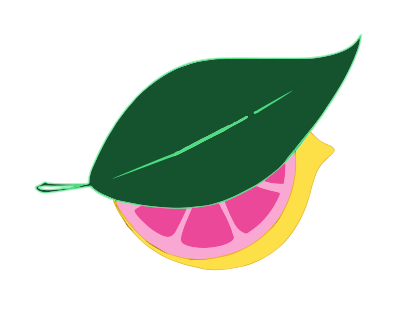

# Crave of the day

> Check out the [website](https://craveoftheday.com)!



## About

Crave of the day is a website and twitter bot that posts a new snack every day. It uses AI to generate the new snacks.

## Tech Stack

- [Next.js](https://nextjs.org/) app router
- [OpanAI](https://openai.com/) GPT-3, GPT-4 and DALL·E 2
- [DALL·E 2](https://openai.com/blog/dall-e-2/) for generating images
- [Tailwind CSS](https://tailwindcss.com/) for stylings
- Hosted on [Vercel](https://vercel.com/)
- [Twitter API](https://developer.twitter.com/en/docs/twitter-api) for posting to twitter

## Overview

### Snack generation

A list of snacks is generated using the [`scripts/generateMonth.ts](https://github.com/logan-anderson/crave-of-the-day/blob/main/scripts/generateMonth.ts) script. This script

1. Generates a list of snacks using gpt-4 and OpenAI function feature
2. Generates an image for each snack using DALL·E 2 and downloads it to the `public/img` folder
3. Generates a recipe for each snack using gpt-3
4. Stores the list in `content/snacks/<Month>.json`

## Development

### Prerequisites

- [Node.js](https://nodejs.org/en/) (v14 or higher)
- [Yarn](https://yarnpkg.com/) (v1)

### Setup

1. Clone the repository
2. Install dependencies with `yarn install`

### Running the development server

```bash
yarn dev
```

### Building for production

```bash
yarn build
```
